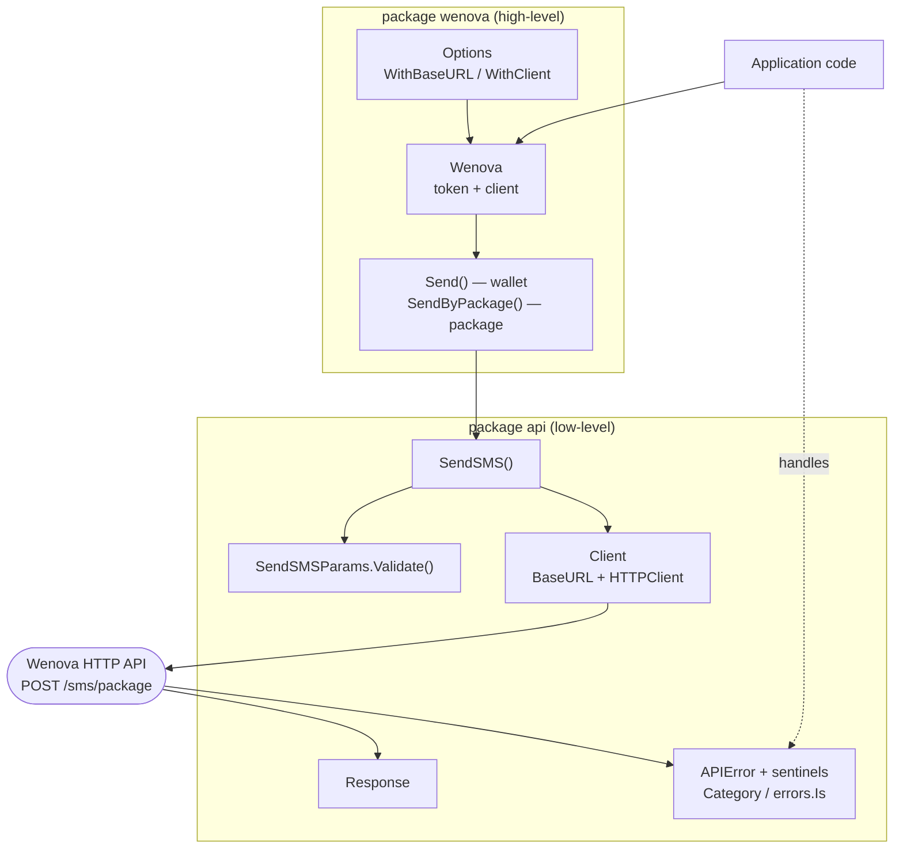
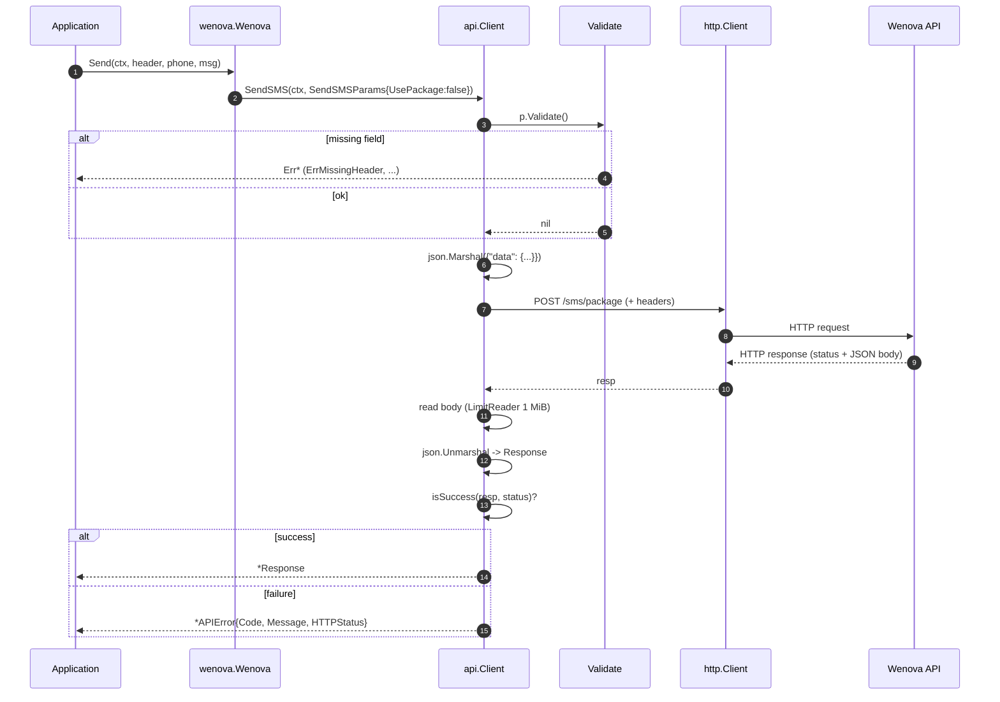
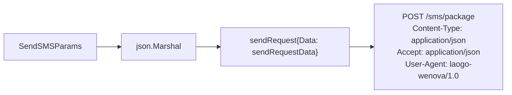
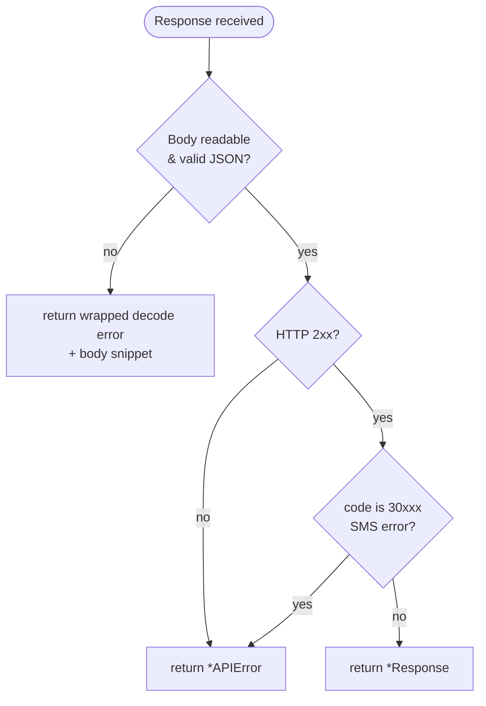
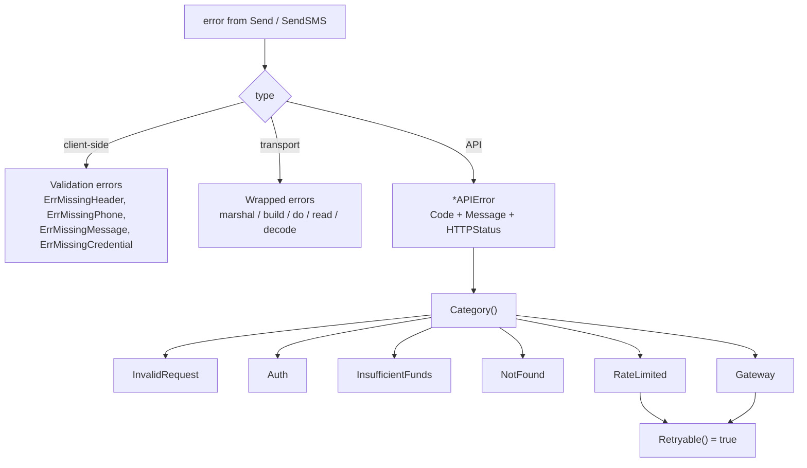
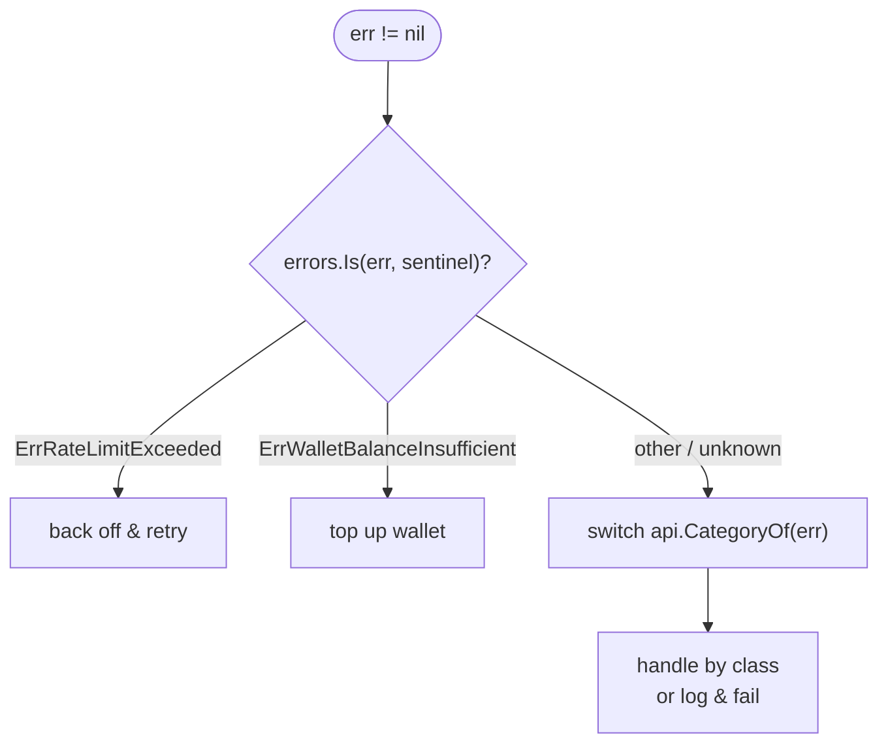

# Wenova SMS Gateway — Technical Documentation

This document describes the internal workflow of the Wenova SMS gateway client:
how a send call flows through the layers, how the HTTP request is built, and how
responses and errors are classified. For usage, see [README.md](./README.md).

## Package layout

Two packages, layered. The high-level `wenova` package is what applications
import; the low-level `api` package owns the HTTP contract.



**Responsibilities**

| Layer    | Owns                                                                       |
| -------- | -------------------------------------------------------------------------- |
| `wenova` | Token storage, default headers, wallet-vs-package choice, ergonomic API.   |
| `api`    | Validation, JSON wire format, HTTP transport, response decoding, errors.   |

`wenova.Send` and `wenova.SendByPackage` are thin wrappers: they differ only in
the `UsePackage` flag passed to `api.SendSMS`.

## Send workflow

End-to-end sequence of a successful send.



Steps 1–2 are the `wenova` layer; everything from step 3 lives in `api.SendSMS`.

## Request shape

The body is wrapped in a `data` envelope, matching the API's `data.*` parameter
naming. `token`/`scriptId` are omitted when zero-valued.



```json
{
  "data": {
    "header": "WNV-OTP",
    "phoneNumber": "2055123456",
    "message": "Your code is 123456",
    "token": "SCRIPT_TOKEN",
    "usePackage": false
  }
}
```

> Note: the `data` envelope and token-in-body are inferred from the published
> parameter doc and have not yet been confirmed against the live endpoint.

## Success vs failure

Wenova signals outcome through the **business code in the JSON body**, not the
HTTP status. `isSuccess` therefore checks both.



A response is a success only when the transport succeeded (2xx) **and** the body
carries no SMS error code. `code == 0` (or any non-30xxx code) on a 2xx response
is treated as success.

## Error model

Errors fall into three groups. All are matchable with `errors.Is`, and the
API-error group is also matchable by sentinel and groupable by `Category`.



**How a caller reacts**



### Code → category mapping

| Code    | Sentinel                            | Category             | Retryable |
| ------- | ----------------------------------- | -------------------- | --------- |
| `30101` | `ErrTokenOrScriptIDRequired`        | InvalidRequest       | no        |
| `30102` | `ErrLinksNotAllowed`                | InvalidRequest       | no        |
| `30105` | `ErrPackageQuotaInsufficient`       | InsufficientFunds    | no        |
| `30106` | `ErrWalletBalanceInsufficient`      | InsufficientFunds    | no        |
| `30302` | `ErrWalletNotFound`                 | NotFound             | no        |
| `30303` | `ErrPackageNotFound`                | NotFound             | no        |
| `30307` | `ErrTokenNotFound`                  | Auth                 | no        |
| `30308` | `ErrScriptIDNotFound`               | Auth                 | no        |
| `30501` | `ErrRateLimitExceeded`              | RateLimited          | **yes**   |
| `30901` | `ErrGatewayError`                   | Gateway              | **yes**   |

## Design notes

- **Business code over HTTP status.** The API may return `200 OK` with a `30xxx`
  failure in the body, so outcome is determined by `isSuccess`, not the status
  line alone.
- **Bounded, preserved bodies.** Responses are read through a 1 MiB
  `io.LimitReader`; a non-JSON body (e.g. a proxy's HTML error page) is surfaced
  verbatim as a short snippet instead of being discarded.
- **No client-side phone validation.** Beyond a non-empty check, recipient
  format is left to the server — it is the source of truth for valid numbers.
- **`errors.Is`-first ergonomics.** `APIError.Is` matches by code, so sentinels
  match the live error regardless of its `Message`/`HTTPStatus`, even when
  wrapped with `fmt.Errorf("...: %w", err)`.
- **No built-in retries.** `Retryable()` / `IsRetryable` classify errors, but the
  caller (or a future `Client` wrapper) owns the retry loop and backoff.
```
